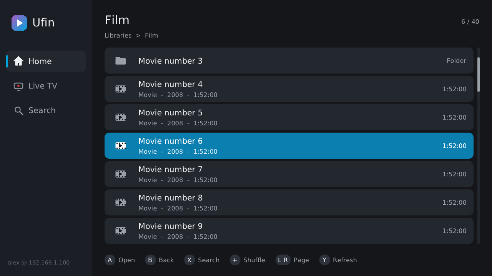
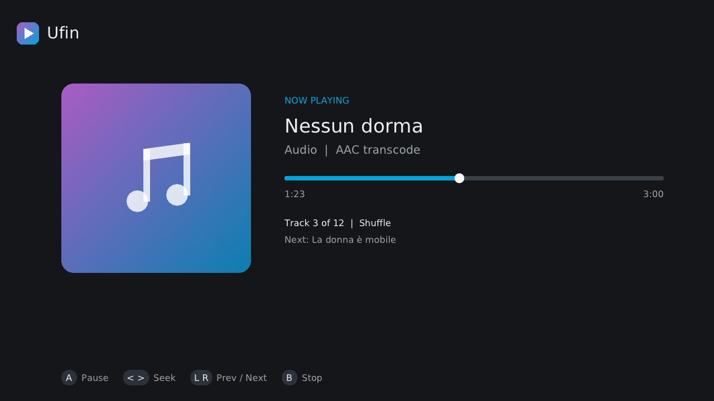
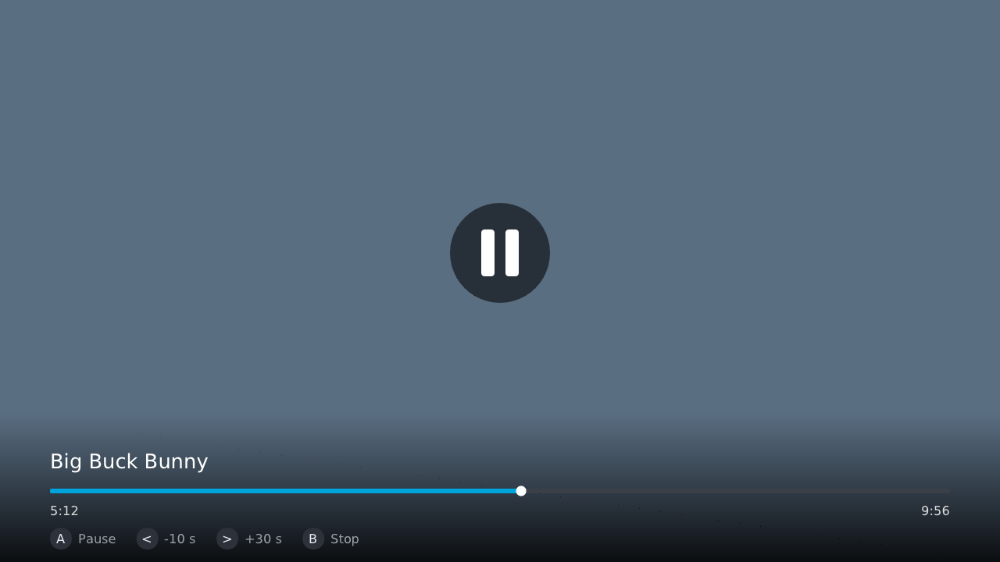
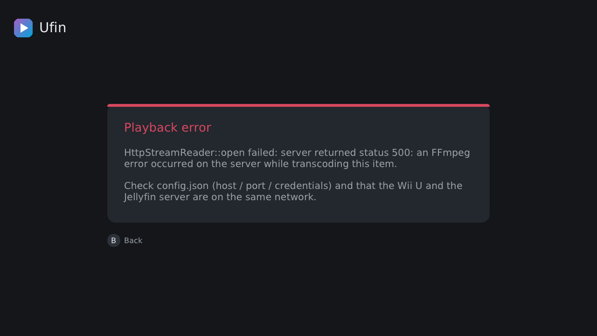

# Ufin - A Wii U Jellyfin client

WIP jellyfin client for the Nintendo Wii U

---

> ⚠️ **Beta 1.0:** Music and video playback, including 720p30 H.264 video, have been confirmed working on real hardware. The new GX2 + Dear ImGui interface and the v0.2 feature set have also been tested on real hardware. Playback can stutter heavily on poor or congested network connections, but audio/video should stay synchronized and resume from the correct position when the stream catches up or restarts. if anyone can test on Ethernet or stable WiFi and report how the playback is in an issue would be appreciated

# Jellyfin Wii U

A native Jellyfin client for the Nintendo Wii U because why not XD.

**Beta development.** Expect bugs, crashes, and probably the occasional Wii U death beep.

> Beta v1.0.0 will be released in the next few days

## Current status

### Tested and working on real hardware

* ✅ Wii U ↔ Jellyfin connection
* ✅ Authentication
* ✅ Library browsing
* ✅ Playback report to Jellyfin
* ✅ Music playback
* ✅ Video playback (720p30 H.264 baseline + AAC, transcoded by the server)
* ✅ Video seeking / stream restart
* ✅ Pause / resume
* ✅ Resume / Start over
* ✅ Watched state and resume bars
* ✅ Favourites
* ✅ Music queue and shuffle, with previous/next track
* ✅ Search across all libraries with the Wii U on-screen keyboard
* ✅ GX2 + Dear ImGui interface: sidebar, library browser, Now Playing, and HUD over video
* ✅ Touch: tap a sidebar entry or a list row on the GamePad
* ✅ Posters, album art and channel logos, loaded in the background from Jellyfin
* ✅ Menu music
* ✅ Continue watching, Next up and Favourites on Home; Resume / Start over
* ✅ Autoplay the next episode after a countdown
* ✅ Watched ticks, resume bars, unwatched counts and favourite hearts in lists
* ✅ GamePad screen off during TV playback
* ✅ Jellyfin 10.8 through 12.x
* ✅ GamePad controls

### Implemented, but not yet fully tested on real hardware

* 🧪 Audio and subtitle track selection
* 🧪 Quick Connect sign-in
* 🧪 Live TV
* 🧪 Wii Remote (+ Nunchuk / Classic Controller)
* 🧪 Wii U Pro Controller

The GamePad is currently the only controller fully tested on real hardware. The other controller implementations will be tested before the final Beta 1.0 release.

Ufin currently relies on Jellyfin server-side transcoding for its known-good video path. The recommended format is 720p30 H.264 Baseline + AAC.

## Goals

* 480p60 software playback
* 1080p30 hardware playback if possible
* Eventually, direct play where possible
* Wii U Gamepad as a separate player control screen or music visualizer

## Installation

1. Download the ZIP file from the "Releases" page.

2. Extract the contents of the ZIP to the root of your Wii U's SD card.

3. Open "config.json" and enter your Jellyfin server details and credentials.
   Optional keys: `video_bitrate` (bits/s, default 2500000) and `video_profile`
   (`baseline` is the default and the safe choice for the Wii U's hardware
   decoder; `main`/`high` are there for experiments).

4. Insert the SD card into your Wii U and launch Ufin through your preferred homebrew method.

## Screenshots

Rendered by the host tests (`UFIN_UI_PREVIEW=<dir> tests/host/build/test_ui <font.ttf>`);
on the console the Wii U's own system font is used.

| Library browser                          | Now Playing                                      |
| ---------------------------------------- | ------------------------------------------------ |
|  |  |
| **Video HUD (paused)**                   | **Error card**                                   |
|   |      |

## Signing in

Just start Ufin: it asks for the server address (e.g. `192.168.1.100:8096`) and
either your username + password, or **Quick Connect** -- Ufin shows a 6-digit
code, and you approve it from Jellyfin on your phone or PC (profile -> Quick Connect). Ufin then saves a sign-in token (never your password) to
`sd:/wiiu/apps/ufin/config.json`, so next time it connects straight away.
**Settings -> Sign out** forgets it. A hand-written config.json with
`host`/`port`/`username`/`password` still works too.

> Quick Connect is implemented but has not yet been tested because the current test Jellyfin setup does not have Quick Connect configured.

## Menu music

Select any song in your music library and press **-**: it becomes the menu
music, looping quietly while you browse (and stopping for real playback).
Turn it on or off in **Settings**.

## Settings

Menu music, accent colour, animated background, CRT mode, snow, a clock, and
your account (sign out). There may also be something hidden in *About*...

## Controls

| GamePad / Pro / Classic | Wii Remote            | Action                                                         |
| ----------------------- | --------------------- | -------------------------------------------------------------- |
| D-pad / left stick      | D-pad (Nunchuk stick) | Move (hold to scroll fast); left/right switch sidebar and list |
| L / R                   | Nunchuk C / Z         | Page up / down                                                 |
| A                       | A                     | Open / play                                                    |
| B                       | B                     | Back (from the top level: to the sidebar); stops playback      |
| X                       | 1                     | Search                                                         |
| Y                       | 2                     | Favourite / unfavourite                                        |
| ZL                      | --                    | Mark watched / unwatched                                       |
| ZR                      | --                    | Refresh the list                                               |
| +                       | +                     | Shuffle the selected album/playlist, or all songs in the list  |
| -                       | -                     | Use the selected song as menu music                            |
| Touch                   | --                    | Tap a sidebar entry or a list row                              |

During playback: **A** pause / resume, **Left** back 10 s, **Right** forward 30 s
(presses add up: Right three times = +90 s), **Y** (Wii Remote: 2) audio &
subtitles, **-** GamePad screen on/off, **B** stop. Live TV has B and -.
Changing a track restarts the stream at the same point, like a skip.
Skipping restarts the server's transcode at the new position, so it takes a
moment, like starting playback.

Picking a song plays it and the songs after it in the list. While music plays,
**L / R** (or ZL / ZR) go to the previous / next track -- L restarts the song if
it's more than 3 s in. Now Playing shows the track number and what's next.

## SD Card Layout:

```text
SD:/
├── wiiu/
│   └── apps/
│       └── ufin/
│           ├── ufin.wuhb
│           └── config.json
```

## How video works

The Wii U has no public software H.264 decoder fast enough for 720p, so Ufin
leans on two things:

* **Server side:** Jellyfin is asked to transcode to exactly 1280x720 H.264
  *baseline* + AAC in fragmented MP4. The exact size matters -- the
  `h264_wiiu` decoder in FFmpeg-wiiu sizes its framebuffer as
  width x height x 1.5 while the hardware writes with a 256-pixel pitch and
  16-row height alignment, and 1280x720 is the size where those agree.
  Non-16:9 content therefore arrives anamorphically squeezed and is
  un-squeezed at draw time using the aspect ratio from the item's metadata.
  Baseline profile means no B-frames, so the hardware decoder's
  one-frame-per-call output comes out in display order.
* **Console side:** frames are decoded by the Wii U's hardware decoder
  (`h264.rpl`, through `h264_wiiu`), uploaded as two GX2 textures (Y and
  interleaved UV) and converted to RGB by a small pixel shader
  (`src/media/shaders/nv12_video.frag`). Video is paced against the audio
  clock; late frames are dropped.

Debugging aids: all `OSReport` lines are prefixed `Ufin:` (visible over a
Cemu/serial log, and also written to `sd:/wiiu/apps/ufin/ufin_log.txt` as a
fallback for networks that drop the UDP log)

Two fixes were needed to get video actually displaying continuously on real
hardware (as opposed to Cemu, where the original code already worked):

* **A persistent GX2 context.** Tearing GX2's context down and rebuilding it
  for every playback/keyboard session computed correct frames that real
  hardware never actually scanned out. GX2 (via `ui::Gfx`) is now brought up
  once for the whole run and never torn down mid-session; there's no more
  hand-off between a separate menu display system and GX2 either, which
  removes the failure mode entirely rather than just working around it.
* **A full fixed-function state reset per draw**, including alpha test.
  GX2's state isn't reset to sane defaults automatically; real hardware's
  leftover state (unlike Cemu's clean GX2 model) left the video quad
  alpha-tested away on real consoles even though the same code drew fine in
  Cemu.

## Development

Built with WUT/devkitPro and tested on real Wii U hardware.

### Building

1. Install devkitPro with `wiiu-dev` and `wiiu-sdl2`. On Debian/Ubuntu/Mint
   the installer must be fetched with `wget -U "dkp-apt" https://apt.devkitpro.org/install-devkitpro-pacman`
   (the site's firewall blocks plain wget).
2. Build [FFmpeg-wiiu](https://github.com/GaryOderNichts/FFmpeg-wiiu) **with
   `patches/ffmpeg-wiiu-fixes.patch` applied** (`git apply` in the FFmpeg-wiiu
   checkout). It fixes a heap overflow in `h264_wiiu` (framebuffer sized as
   width*height*1.5 although the hardware writes a 256-pixel pitch and a
   16-row aligned height), reads the packet from `avpkt->data` instead of
   `avpkt->buf`, checks its allocations, and adds `--disable-network`
   (current wut ships its own `inet_aton`, which clashes with FFmpeg's).
   Then, with `DEVKITPRO`, `DEVKITPPC` and `WUT_ROOT=$DEVKITPRO/wut` set:
   `./configure-wiiu && make -j$(nproc) && sudo -E make install`.
3. Put `glslcompiler.elf` from [CafeGLSL](https://github.com/Exzap/CafeGLSL/releases)
   in `tools/`, then `mkdir build && cd build && cmake .. && make`.

After `make`, `tools/check_wiiu_build.sh` checks the objects for thread-local
storage, which the Wii U's RPX format can't hold (elf2rpl then fails with
"Unsupported relocation type").

### Testing in Cemu

Cemu maps `sd:/` to its `sdcard` folder (`~/.local/share/Cemu/sdcard` for the
Linux AppImage), so put `config.json` in `sdcard/wiiu/apps/ufin/`. Set up an
emulated **Wii U GamePad** in Options -> Input settings. `127.0.0.1` works as
the host when Jellyfin runs on the same PC (on a real Wii U it must be the
PC's LAN address). The log with all `Ufin:` lines is Cemu's `log.txt`; on
start-up it reports `Ufin: GX2 + ImGui ... ready` once the display is up.

Everything that doesn't touch the Wii U hardware also has host-side tests
(plain `g++`, no devkitPro needed): the menu screens, the Jellyfin client and
HTTP layer, the config loader, the frame queue, the audio clock, and the real
decoder/HTTP-stream chain pulling a fragmented MP4 over HTTP.

```text
tests/host/run_tests.sh                      # UI, Jellyfin client, config
FFMPEG_HOST=/path/to/ffmpeg tests/host/run_tests.sh   # + FFmpeg-based tests
```

See the header of `tests/host/run_tests.sh` for how to build the FFmpeg
prefix it wants.

This project is developed with really heavy AI assistance (Claude, Gemini and ChatGPT Free tiers). Architecture, design, testing and development decisions are human, tho the majority of the code is generated by AI, I am not a programmer yet, and this was my way to make something no one else has yet

## Credits

Huge credit to https://github.com/GaryOderNichts/FFmpeg-wiiu for his work on FFmpeg for Wii U. Ufin uses this work for its Wii U FFmpeg backend.

Another huge credit to https://github.com/LandValueGen for the major v0.2 feature work, including the new GX2 + Dear ImGui UI, media browsing features, playback UI, music features, settings, controller support, authentication flow, artwork handling and other parts of the v0.2 architecture.

The final real-hardware integration also includes additional debugging, state-management fixes and testing performed in Ufin's main branch.

UI layout inspired by [CaféMP](https://github.com/whateveritwas/cafemp) (sidebar, list browser, player HUD). No CaféMP code or artwork is used; Ufin's screens and icons are drawn by its own code.

Libraries included in `src/vendor/` (licence texts alongside):

* [Dear ImGui](https://github.com/ocornut/imgui) (MIT) with the Wii U GX2 renderer from https://github.com/dkosmari/imgui (MIT, GaryOderNichts and Daniel K.O.)
* [stb_image](https://github.com/nothings/stb) (public domain / MIT) for JPEG/PNG artwork
* [cJSON](https://github.com/DaveGamble/cJSON) (MIT)

## Contributing

Contributions and help are welcome!, as i'm not a full programmer yet, i can only maintain and do small features, this project was born as an idea, and it is what it is now thanks to our contributors!

Bug reports, testing feedback, fixes and smaller improvements are all useful, if you dont own real hardware just let me know and i'll try to test as much as possible.

For **large features, major changes, substantial refactors, or anything that would significantly change the project's architecture**, please contact me first at **[ufin.project@gmail.com](mailto:ufin.project@gmail.com)** so we can discuss it before implementation.

When reporting bugs, useful information includes:

* Whether it happened on a real Wii U or Cemu
* Jellyfin version
* Media format / resolution
* Network setup
* Steps to reproduce the issue
* Relevant `Ufin:` log output

Ufin is a student-built project, so responses and development may not always be immediate.
